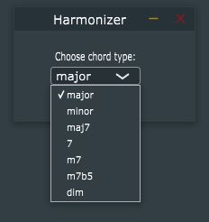

# harmonizer_vst

VST plugin, which adds chosen chord (7 available) to prime played on MIDI keyboard. In addition after pressing adjacent black key changes chord to dominant 7th. 
Also, after pressing adjacent white key, the chord changes it's mode to opposite (for example, if mode is major it results in minor).

